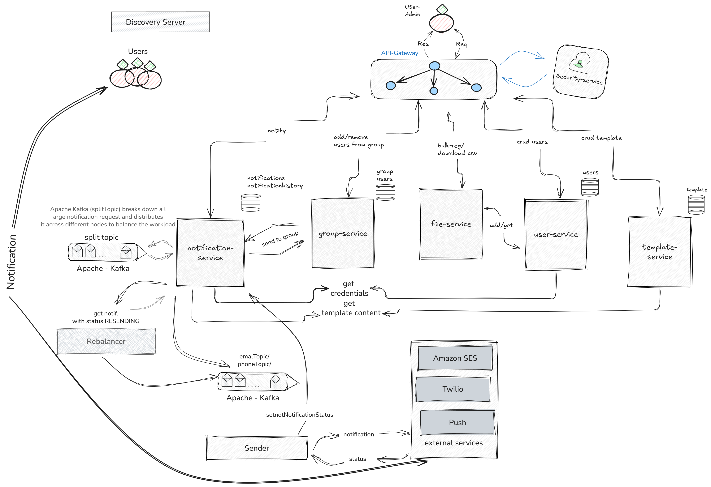
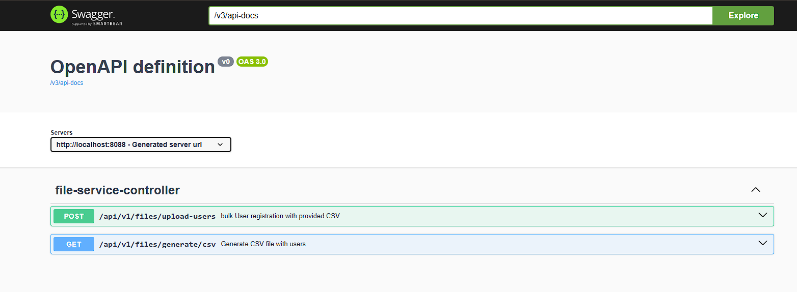
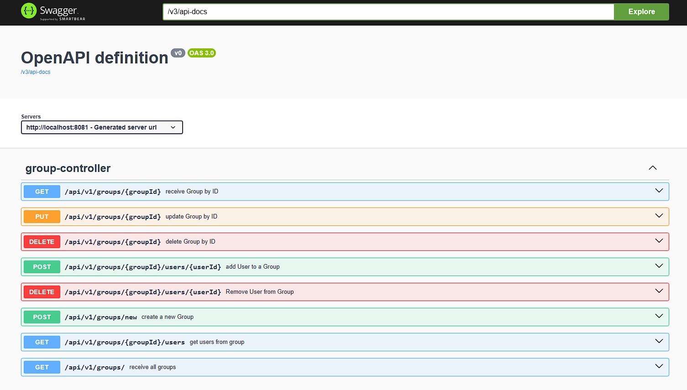
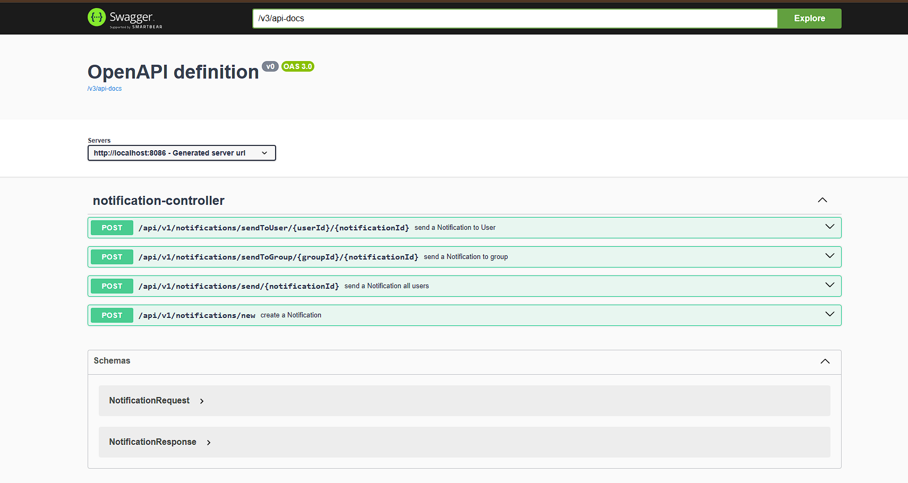
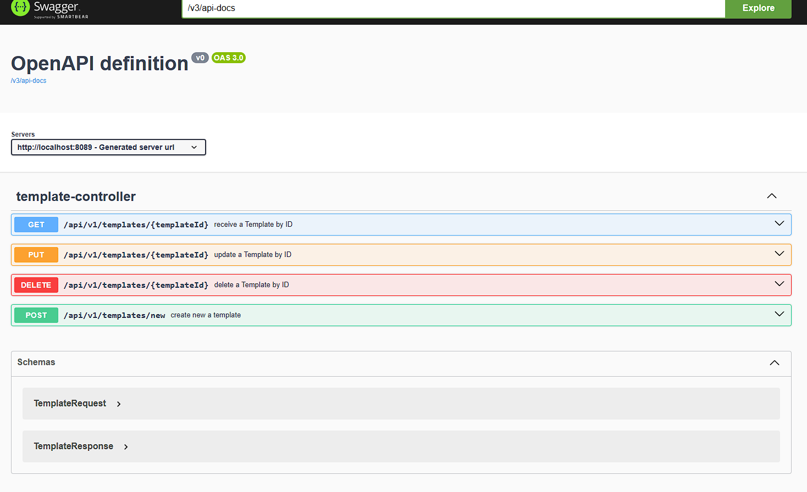
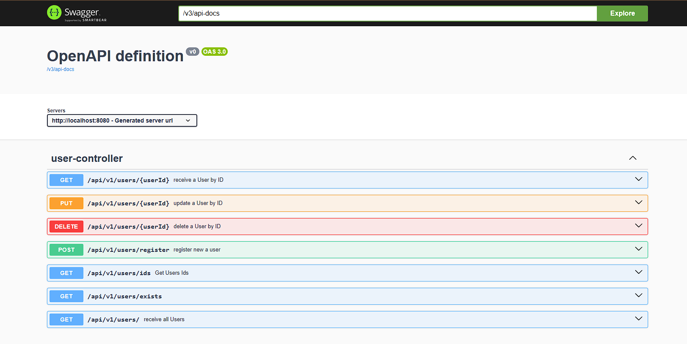

# Emergency Notification System
> This system enables fast and reliable delivery of notifications to a large number of recipients,
> particularly during emergency situations.

## Functional requirements:
-[x] **Notification Sending:** Users with the `ADMIN` role can send notifications 
to registered recipients, 
alerting them about emergency situations through different communication channels, such as:  
   - [x] Email   
   - [ ] Push notifications  
   - [x] SMS

-[x] **Bulk Recipient Registration:** The system should support registering a large number of recipients at once by
importing data from:
   - [ ] .xlsx
   - [x] .csv
-[x] **Notification Templates:**  The system should allow ADMINS to create and manage pre-defined notification
 templates for instantaneously sending notifications.

## Non-functional requirements:

- [ ] **High Availability:** The system should be highly available, ensuring that it is accessible and operational even
  during peak usage or in the event of system failures.
- [x] **Reliability:** The system should be reliable and deliver notifications consistently without any data loss or
  delays.
- [x] **Low Latency:** The system should have low latency, ensuring that notifications are sent and received promptly to
  minimize response time during emergencies.
- [x] **Scalability:** The system should be able to handle a growing number of recipients and notifications without
  compromising performance or functionality.
- [ ] **Security:** The system should have appropriate security measures in place to protect sensitive information,
  prevent unauthorized access, and ensure the privacy and integrity of data.

## Additional Features:

- **Email Update Guarantee:** When registering a recipient with an email address that already exists in the system, the
  existing recipient's information will be updated with the new registration details. (if there are several equal email
  addresses in xlsx file, the last appearance will always overwrite all previous)

## Architecture Diagram

##

### Scalability / Low Latency
The system is built to deliver notifications quickly and efficiently to a large number of users. To achieve this, it uses the following approaches:

- `Request Partitioning:`When a ADMIN sends a large list of user IDs, the system first checks the number of running instances via the Eureka Discovery Server. It then splits the list into equal parts and distributes them across all available instances using Apache Kafka. For example, if a request contains 1,000,000 IDs and there are 100 instances running, each batch of 10,000 IDs is sent to a different instance for processing.

- `Parallel Processing:`With multiple instances running, notifications are processed simultaneously. This greatly improves performance and reduces the time it takes to send notifications.

- `Result Aggregation:` After processing, the results are sent back to Kafka for a different service that handles the actual delivery of notifications. Separating processing from delivery makes the architecture modular and easy to scale.

### Reliability

- `Sender Service:`If the sender service runs into an error while sending a notification, it marks that notification as "RESENDING." This helps track notifications that need to be retried in case of failures or inconsistencies.

- `Rebalancer Service:`The rebalancer service regularly checks for notifications marked as "RESENDING." By doing this, it keeps an eye on failed or pending notifications to make sure nothing gets lost.

- `Transmitting to Kafka:`Once the rebalancer picks up the "RESENDING" notifications, it sends them back to Kafka. This ensures notifications are delivered consistently and reduces any delays or issues from the first attempt.

### Security
- [ ] Security

### Code Coverage: 0%

### Endpoints documentation

